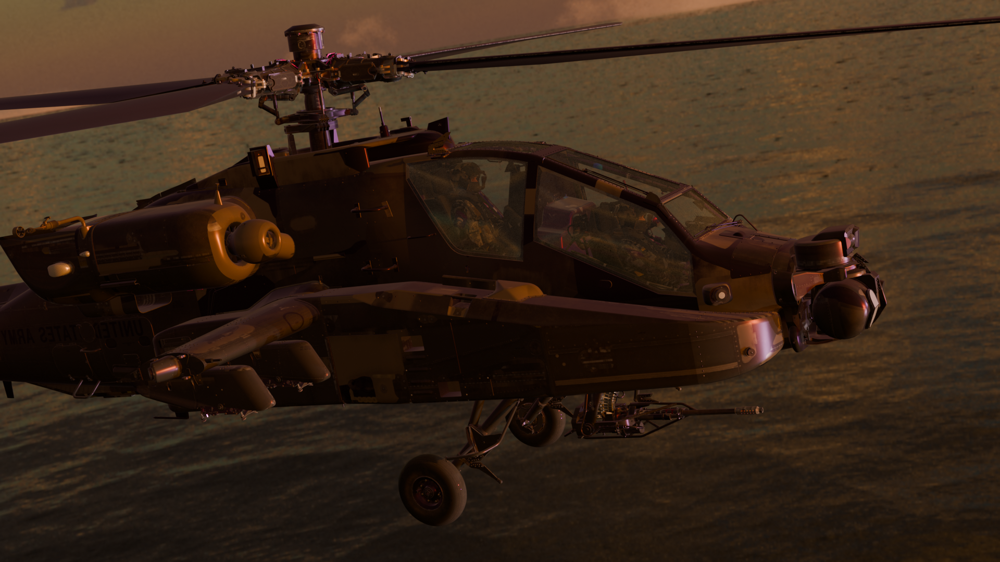
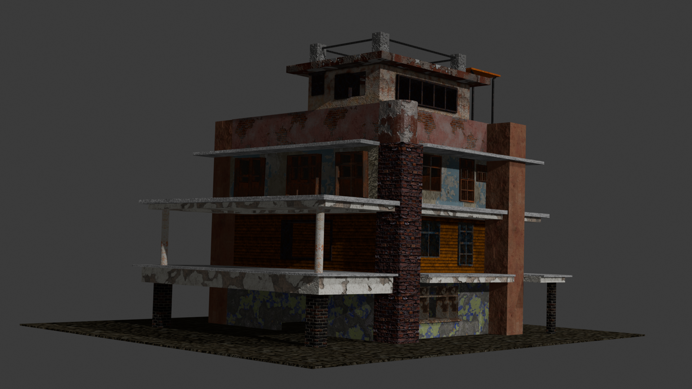
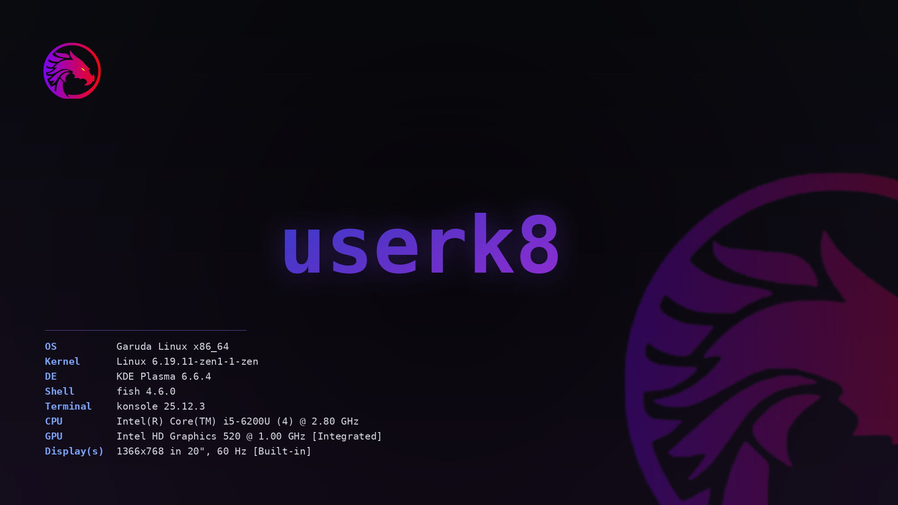

# 🌌 userk8__ | Galactic Portfolio Hub

Welcome to the central command of the **userk8__** journey. This repository hosts a custom-built, vanilla-engineered developer portfolio showing a blend of advanced front-end interactions, native HTML5 canvas mathematical rendering, desktop customizations, 3D cinematic workflows, and on-device machine learning.

> Built entirely with pure imagination, raw code, and a lot of late nights. No heavy external frameworks. No bloated templates. Just performance-tuned vanilla architectures.

---

## 🛠️ Core Engineering & Features

This portfolio isn't just a static directory—it serves as a standalone canvas sandbox displaying several custom interactive systems:

* **Interactive HTML5 Galactic Engine (`index.html`)**: A lightweight canvas rendering loop simulating a 3D rotating starfield. Uses native trigonometric mapping to project stars along an adjustable $28^\circ$ orbital tilt plane with particle drift, automatic twinkle phases, and randomly seeded shooting stars.
* **Vanilla Story Lightbox Core (`renders.js`)**: A custom-engineered, mobile-optimized media gallery engine. Features:
    * An animated interactive photo-stack widget with dynamic rotational offsets on hover.
    * Asynchronous idle lazy loading via `requestIdleCallback` to protect Initial Input Delay (FID).
    * State-tracked multi-segment progress bars mapping real-time image slide duration ($10\text{s}$) alongside dynamic HTML5 video metadata hooks for auto-advance synchronization.
    * Aggressive memory footprint cleanup loops (`removeAttribute('src')` and dynamic garbage collection invocation) to prevent DOM memory leaks during heavy video playback frames.
* **Smooth Rocket Exhaust sequence**: A hardware-accelerated physics animation mimicking a rocket launch trajectory using CSS transforms mapped dynamically against custom coordinate spaces.

---

## 🖼️ Media Render Showcase

Here are some of the 3D environmental design assets, vehicle art setups, and workspace configurations featured directly within the **renders widget**:

### 🎯 Featured: Linux Workspace Development Frame (`render-6.png`)
The primary engineering space running custom environment configurations:


### 🚁 Combat & Architecture Render Set
| 01. DEATH RAY Helicopter Capture | 02. Dilapidated Post-Apocalyptic Compound |
| :---: | :---: |
|  |  |

---

## 🚀 Projects Ecosystem

### 🟢 Live & Active Operations
* **⚡ eight AI** An on-device, highly efficient **1B parameter language model** compiled directly for mobile client-side execution. Utilizing tight **4-bit quantization mappings**, it delivers privacy-preserving, localized natural language intelligence directly on smartphones without reliance on external cloud APIs or server connections.
    * *Status:* Live Now · [Launch Application ↗](https://userk8.github.io/eight-ai/)
* **💾 CODE-WORD** A customized terminal-styled encryption and puzzle environment built using semantic HTML validation.
    * *Status:* Live · [Launch Application ↗](https://userk8.github.io/CODE-WORD/)
* **🤖 QUIZ-BOT** An asynchronous knowledge execution application testing interactive memory algorithms.
    * *Status:* Live · [Launch Application ↗](https://userk8.github.io/QUIZ-BOT/)
* **📊 PERIODIC-TABLE** A fully responsive chemical element coordinate matrix cleanly separating atomic weights and periods inside an adaptive CSS grid layout.
    * *Status:* Live · [Launch Application ↗](https://userk8.github.io/PERIODIC-TABLE/)
* **📝 Text Animation & One Question** Interactive experiments tracking text strings, custom keyframe delays, and lightweight modern prompt handling.
    * *Status:* Live · [Launch Text Animation ↗](https://userk8.github.io/text_animation/) | [Launch One Question ↗](https://userk8.github.io/A-QUESTION/)

### 🔴 Upcoming Projects
* **🌧️ DEATH RAY** *The biotech giant Exteronic has fallen. The sky is bleeding toxic Black Rain, reshaping the DNA of anyone left in the Dead Zone. You are a mercenary on a contract for Matropics: Infiltrate, rescue the scientists, and survive the storm. But as your Integrity drops, the truth about Subject 0 begins to surface.*
    * **Core Systems:** Dynamic survival mechanics, integrated integrity metrics, hazard proximity calculations, and linear interactive cinematic storytelling.
    * *Status:* Under Heavy Development / Coming Soon

---

## 📟 Personal Dev Environment (Garuda Configuration)
The backdrop environment used for coding this site, configured on a dedicated rolling release system:



```ini
[SYSTEM INFORMATIONAL METRICS]
OS       = Garuda Linux x86_64
Kernel   = Linux 6.19.11-zen1-1-zen
DE       = KDE Plasma 6.6.4
Shell    = fish 4.6.0
Terminal = konsole 25.12.3
CPU      = Intel(R) Core(TM) i5-6200U (4) @ 2.80 GHz
GPU      = Intel HD Graphics 520 @ 1.00 GHz [Integrated]
Display  = 1366x768 @ 60 Hz
